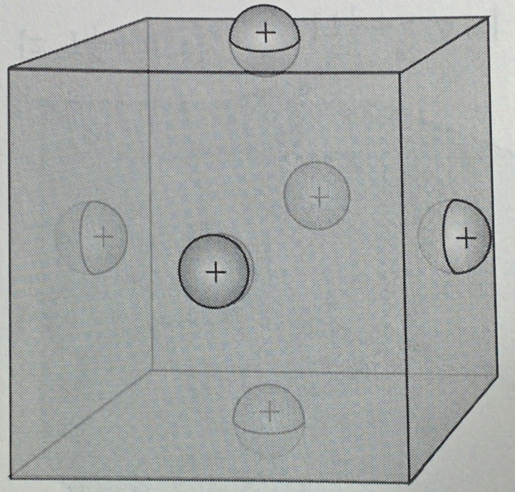
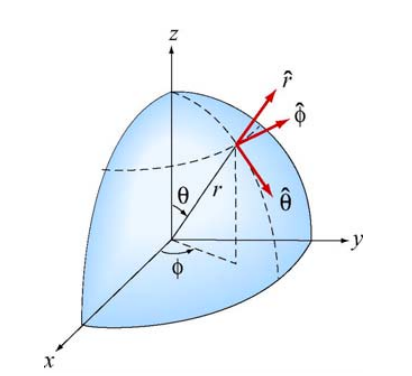
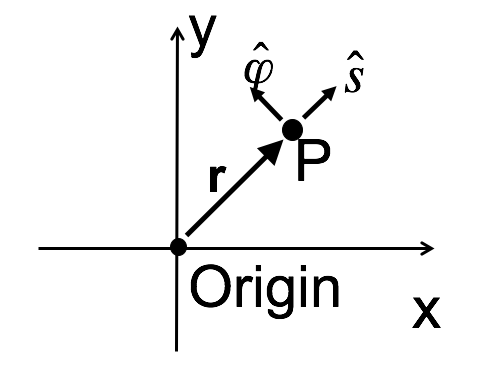

<section data-markdown="">
		
## DRAFT DRAFT DRAFT
    
### PH410 - Electromagnetism

August 30
 <!--this doesn't work... -->
</section>

<section data-markdown>

Which of the following two fields has zero curl?

| I | II |
|:-:|:-:|
|  |   |

1. Both do.
2. Only I is zero
3. Only II is zero
4. Neither is zero
5. ???

Note:
* CORRECT ANSWER: C
* Think about paddle wheel
</section>
<section data-markdown>

Curl/div visualizations 

https://mathinsight.org/divergence_idea

https://mathinsight.org/divergence_subtleties

https://mathinsight.org/curl_components

https://mathinsight.org/curl_subtleties

</section>
<1--<section data-markdown>
As we wait for class to start, chat and answer this on slack.
If these are electric field lines from a point charge in 3D space, what is the divergence in the boxed region?

1. Zero
2. Not zero
3. ???

Note:
* CORRECT ANSWER: A
* Lines in; lines out - harder to see dE/dx and dE/dy
* One of those curious ones where the 2D picture might get in the way; think 3D

</section>-->

<section data-markdown="">

### For Friday
- Read Griffiths Sections 1.5 & 1.6
- Do reading survey by 10am on Wednesday (s3)
- Homework 1 due
	
</section>

<section data-markdown>
As we wait for class to start, chat and answer this on slack.
Which of the following two fields has zero divergence?

| I | II |
|:-:|:-:|
|  |   |

1. Both do.
2. Only I is zero
3. Only II is zero
4. Neither is zero
5. ???

Note:
* CORRECT ANSWER: B
* Think about dE/dx and dE/dy
</section>

<section data-markdown>
	
 
	
</section>

<!--<section data-markdown>

 

### You derive it

Consider the radial unit vector ($\hat{r}$) in the spherical coordinate system as shown in the figure.

Determine the $z$ component of this unit vector in the Cartesian $(x,y,z)$ system as a function of $r,\theta,\phi$.

Note:
This demonstrates that the r unit vector is a curious thing, in fact in contains all the information that is needed to define where you on the unit sphere. The other vectors can be though of as defined relative to that.
Altered for F2017 to be shorter, only work on z component
</section>
-->

<section data-markdown>

 

In cylindrical (2D) coordinates, what would be the correct description of the position vector $\mathbf{r}$ of the point P shown at $(x,y) = (1, 1)$?

1. $\mathbf{r} = \sqrt{2} \hat{s}$
2. $\mathbf{r} = \sqrt{2} \hat{s} + \pi/4 \hat{\phi}$
3. $\mathbf{r} = \sqrt{2} \hat{s} - \pi/4 \hat{\phi}$
4. $\mathbf{r} = \pi/4 \hat{\phi}$
5. Something else entirely

Note:
* CORRECT ANSWER:  A
* Fall 2016: [6] 90 3 0 1; Second vote (discussion and hint about units): [54] 35 4 1 4

</section>
<section data-markdown>
 

In spherical coordinates, what would be the correct description of the position vector $\vec{r}$ of the point P shown at $(x,y,z) = (0,2~{\rm m},0)$?
1. $\vec{r}=(2~{\rm m})\hat{r}$
2. $\vec{r}=(2~{\rm m})\hat{r}+\pi\hat{\theta}$
3. $\vec{r}=(2~{\rm m})\hat{r}+\pi\hat{\theta}+\pi\hat{\phi}$
4. $\vec{r}=(2~{\rm m})\hat{r}+\pi\hat{\theta}+\frac{\pi}{2}\hat{\phi}$
5. something else
</section>

<section data-markdown>

You are trying to compute the work done by a force, $\mathbf{F} = a\hat{x} + x\hat{y}$, along the line $y=2x$ from $\langle 0,0 \rangle$ to $\langle 1,2 \rangle$. What is $d\mathbf{l}$?

1. $dl$
2. $dx\~\hat{x}$
3. $dy\~\hat{y}$
4. $2dx\~\hat{x}$
5. Something else

Note:
* CORRECT ANSWER: E
* It's $dx\~\hat{x}+dy\~\hat{y}$.
* Fall 2016 (given right at the end of class): 8 6 8 58 [20]; 5 0 3 38 [54]

</section>

<section data-markdown>

You are trying to compute the work done by a force, $\mathbf{F} = a\hat{x} + x\hat{y}$, along the line $y=2x$ from $\langle 0,0 \rangle$ to $\langle 1,2 \rangle$. Given that $d\mathbf{l} = dx\;\hat{x}+dy\;\hat{y}$, which of the following forms of the integral is correct?

1. $\int_0^1 a\;dx + \int_0^2 x\;dy$
2. $\int_0^1 (a\;dx + 2x\;dx)$
3. $\frac{1}{2} \int_0^2 (a\;dy + y\;dy)$
4. More than one is correct

Note:
* CORRECT ANSWER: D
* All are correct forms, but B and C are ready to integrate.
* Fall 2016: 7 3 0 [90] 0

</section>

<section data-markdown>

A certain fluid has a velocity field given by $\mathbf{v} = x\hat{x} + z \hat{y}$. Which component(s) of the field contributed to "fluid flux" integral ($\int_S \mathbf{v}\cdot d\mathbf{A}$) through the x-z plane?

1. $v_x$
2. $v_y$
3. both
4. neither

Note:
* CORRECT ANSWER: B
* Only the vector perpendicular to the surface will contribute
* Fall 2016: 16 [78] 4 0 0
</section>

<section data-markdown>

A certain fluid has a velocity field given by $\mathbf{v} = x\hat{x} + z \hat{y}$. If we intend to calculate the "fluid flux" integral ($\int_S \mathbf{v}\cdot d\mathbf{A}$) through the x-z plane, what is $d\mathbf{A}$ in this case? Be specific!

1. $\langle dx\,dy, 0, 0\rangle$
2. $\langle dx\,dz, 0, 0\rangle$
3. $\langle dy\,dz, 0, 0\rangle$
4. It's none of these

</section>

<section data-markdown>

For the same fluid with velocity field given by $\mathbf{v} = x\hat{x} + z \hat{y}$. What is the value of the "fluid flux" integral ($\int_S \mathbf{v}\cdot d\mathbf{A}$) through the entire x-y plane?

1. It is zero
2. It is something finite
3. It is infinite
4. I can't tell without doing the integral

Note:
* CORRECT ANSWER: A
* The velocity field is parallel to the x-y plane every where and hence contributes no flux through the surface.
* Fall 2016: [89] 9 3 0 0

</section>

<section data-markdown>

A rod (radius $R$) with a hole (radius $r$) drilled down its entire length $L$ has a mass density of $\frac{\rho_0\phi}{\phi_0}$ (where $\phi$ is the normal polar coordinate).

To find the total mass of this rod, which coordinate system should be used (take note that the mass density varies as a function of angle):

1. Cartesian ($x,y,z$)
2. Spherical ($r,\phi,\theta$)
3. Cylindrical ($s, \phi, z$)
4. It doesn't matter, just pick one.

Note:
* CORRECT ANSWER: C
* It makes the most sense from the geometry of the problem and writing the limits.
* Fall 2016: 0 0 [94] 6 0

</section>

<section data-markdown>

What is the divergence in the boxed region?

1. Zero
2. Not zero
3. ???

Note:
* CORRECT ANSWER: A
* Lines in; lines out - harder to see dE/dx and dE/dy
* One of those curious ones where the 2D picture might get in the way; think 3D

</section>

<section data-markdown>
Consider a vector field defined as the gradient of some well-behaved scalar function:
$$\mathbf{v}(x,y,z) = \nabla T(x,y,z).$$

What is the value of $\oint_C \mathbf{v} \cdot d\mathbf{l}$?

1. Zero
2. Non-zero, but finite
3. Can't tell without a function for $T$

Note:
* CORRECT ANSWER: A
* Closed loop integral of a gradient is zero.
* Fall 2016: [92] 4 4 0 0

</section>
<section data-markdown>
Consider a vector field defined as the gradient of some well-behaved scalar function:
$$\mathbf{v}(x,y,z) = \nabla T(x,y,z).$$

What is the value of $\oint_C \mathbf{v} \cdot d\mathbf{l}$?

1. Zero
2. Non-zero, but finite
3. Can't tell without a function for $T$

Note:
* CORRECT ANSWER: A
* Closed loop integral of a gradient is zero.
* Fall 2016: [92] 4 4 0 0

</section>

<!--
<section data-markdown="">

## Take a minute to reflect.
What do you want out of this course? Perhaps a deeper understanding of the universe, perhaps better critical thinking skills, perhaps a certain grade. 

Are you on the right path for your own goals, whatever they are, for this semester? Are you reading how you should for where you're at with you current skills? Thinking deeply enough about the homework? 

</section>
-->
